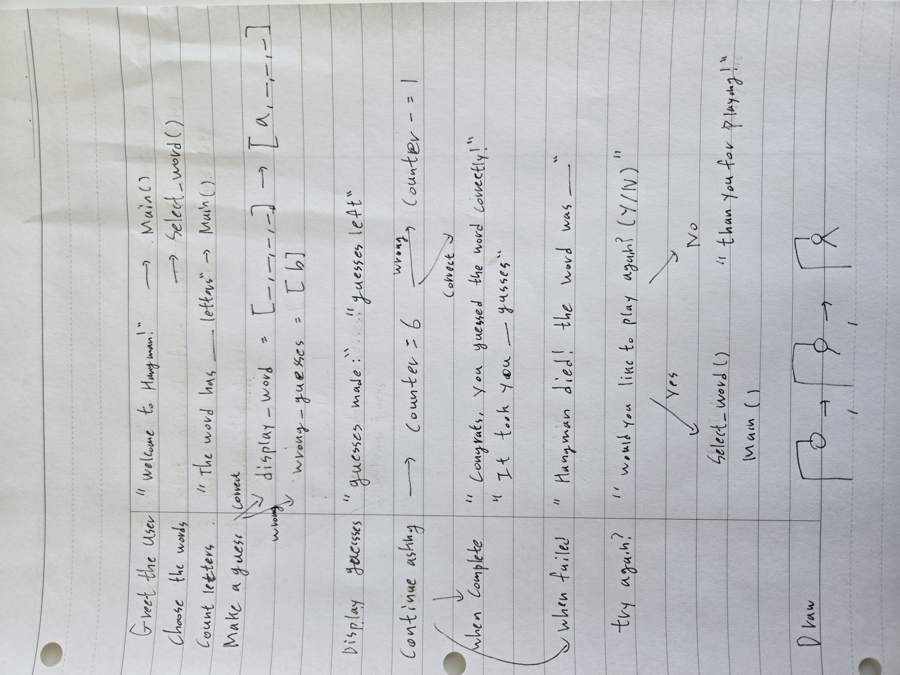

# Hangman-Game
This is a simple Hangman game written in Python.

## Requirements
Python 3.x (No external libraries required)

## Process
First I took some time to read the challange to understand the requirements.
Then, I wrote on a piece of paper the requirements and how I want to implement them.

After that, I started developing the python script.
As I was wrting the script, there were several moments when I realized my initial approach wasn't as efficient as it could be, and I found better solutions along the way.

For example, I initially planned to define a display_word variable (which would store the current word with guessed letters like _ _ _ D _ A) as a list. But this approach required a for loop to compare each letter in the word with the user's guess and replace the corresponding underscore with the guessed letter. This turned out to be inefficient, especially when the same letter appeared multiple times. So, I switched to using a list comprehension instead of initializing display_word with a for loop.

Also, I was lot more familiar with using list than sets, but while figuring out how to handle repeated letters and show incorrect guesses, I discovered that sets automatically handle duplicates. This was a helpful reminder, as I probably learned this concept at some point but had forgotten about it. It was a good practice to remind things like that.

I took about 30 minutes to read the requirments and write the plan, and spend almost 4 hours on writing the script.

# unfinished work
I belive this program meets all the requirements, but there are few thing I would have worked on if I had more time.

- Adding more list of words by category: define few more list of words as constant and make select_word() to prompt user to choose category and return a random word from the appropriate list.
- Web Interface: While the current game is a terminal-based application, a simple web interface can be implement using a framework like Flask or Django

## License
This project is open-source and available under the MIT License.